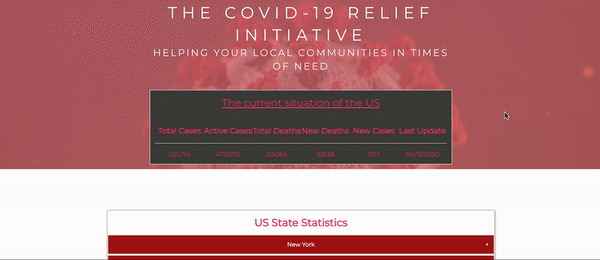
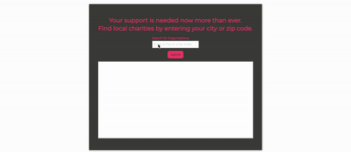

## Covid-19 Donation App: Helping your local community in times of need! 
Find local medical and health charities to aid in the fight against Covid-19!

# Concept: 
Everyone is currently being affected by the coronavirus in one way or another, and Covid-19 Donation App provides a way for people to make a meaningful contribution. One of the early problem of the coronavirus outbreak was the lack of "essential" items. We thought about helping people find stores that had items in stock like toilet paper and hand sanitizer, but then we figured that that could easily be found via Google or Amazon. We then considered having facilities in need create a "wish list" and then people could pick which wish list/order they would like to  fulfill. We also considered using the covid data for a travel app where people could go to places. We finally decided on providing a list of charities that a donor can choose from. 

# Process: 
We decided to use the Foundation framework. Tasks and roles were self-assigned, everyone picked their strong points, but we stayed on group sessions to discuss and issues that we encountered so we could tackle them together. 

We encountered CORS errors which were remedied by https://cors-anywhere.herokuapp.com/
From <https://app.slack.com/client/TT9V3PY6R/GUL9SK3FF/details/members> 

We also has issues with filtering the charity types that were returned from the API. We didn't want to include sports, arts and other unrelated charities, only health/medical organizations. We added variables for search keywords, but we also found documentation defining parameters that can be set to narrow down the results. 

It was difficult to find quality covid-19 APIs since many are so new.

We wanted to include a map which displays the current cases and severity, but there weren’t any readily available. Johns Hopkins provided code for an embedded map which could be used as long as they were credited, but it would not display. It's possible that they have added some type of extra security.

# Images
* Tracker

* Charity Search

# Directions for Future Development
* Color Code By Severity (Severe, High, Moderate, Low, Very-Low)
* Sort by Alphabetical Order, Severity (Ascending & Descending)
* Links to the deployed application and the GitHub repository

# URL
https://github.com/dolinay1/Covid-19-Donation-App

# GitHub Repository
 https://dolinay1.github.io/Covid-19-Donation-App/

 © 2020 Julian Dolinay, Taneisha George, Ryan Parker All Rights Reserved.

